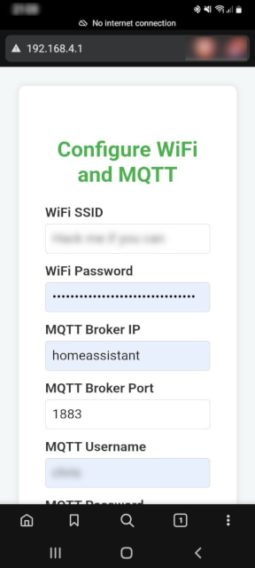
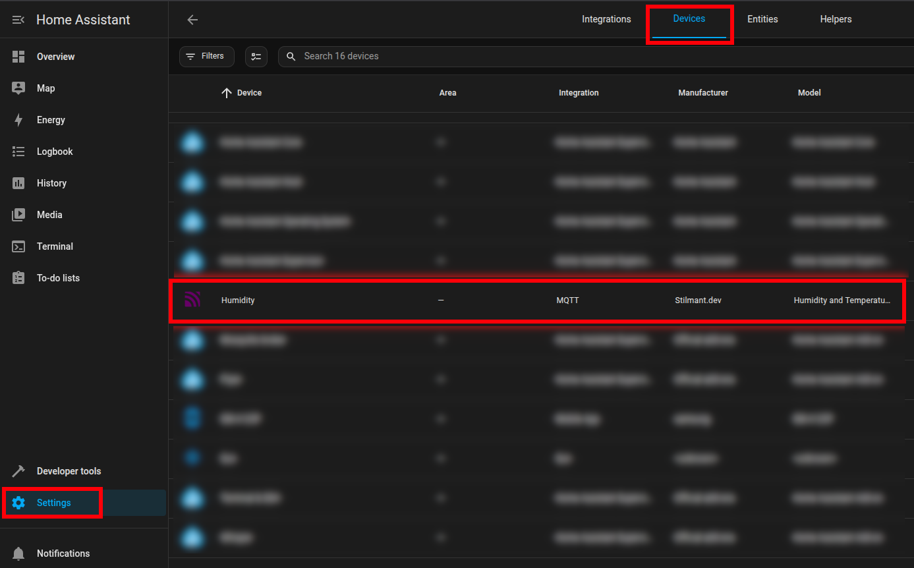
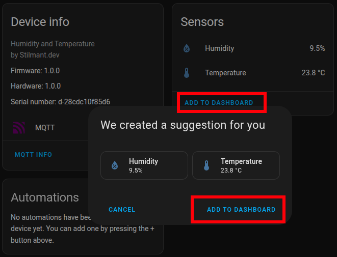

# Connected Humidity and Temperature Sensors

This is a simple MicroPython project to read soil humidity and temperature sensor data using a Raspberry Pi Pico W. It sends the data over MQTT to be integrated with [Home Assistant](https://www.home-assistant.io/).

## What You'll Need

- A Raspberry Pi Pico W (not tested on Pico W 2)
- A soil moisture/humidity sensor (I used an old HD-38 analog sensor)
- A DS18B20 temperature sensor (I used the waterproof version)
- A micro USB cable for power
- (Optional) An NPN transistor (e.g., BC337-40) to switch the moisture sensor off when not in use, extending its lifespan

## Wiring

| Component/Connection     | Pico W Pin           | Notes                                |
| ------------------------ | -------------------- | ------------------------------------ |
| HD-38 + (VCC)            | 3V3 (Pin 36)         | Power supply for the moisture sensor |
| HD-38 - (GND)            | Collector of NPN     | Controlled ground connection         |
| HD-38 AO (Analog Output) | GP26 / ADC0 (Pin 31) | Analog input for moisture level      |
| NPN Emitter              | Pico W GND           | Common ground                        |
| NPN Base                 | GPIO15 (Pin 20)      | Controls the moisture sensor power   |
| DS18B20 VCC              | GPIO17 (Pin 22)      | Switched power for DS18B20           |
| DS18B20 GND              | Pico W GND           | Common ground                        |
| DS18B20 Data             | GPIO16 (Pin 21)      | One-wire data line                   |
| 4.7kΩ Pull-up Resistor   | Between Data & VCC   | Required for DS18B20                 |

## Uploading the Code to the Pico W

1. Flash the MicroPython .uf2 file onto your Pico W, as described in the [official MicroPython documentation](https://micropython.org/download/RPI_PICO_W/).
2. Use mpremote (or another tool) to copy files and run the script:
```bash
mpremote connect /dev/ttyACM0 \
  fs mkdir src \
  fs cp src/*.py :src/ \
  fs mkdir res \
  fs cp res/*.tmpl :res/ \
  fs cp main.py :main.py
```

## Initial Device Setup

On first boot, the device cannot connect to Wi-Fi unless you’ve preconfigured settings in `src/constants.py`. It will enter Access Point mode and serve a configuration page at http://192.168.4.1.



1. Connect your phone or laptop to the device's Wi-Fi.
2. Open http://192.168.4.1 in a browser.
3. Enter/Adapt:
    - Wi-Fi SSID and password
    - MQTT broker address, username, and password
    - Measurement frequency
4. Click Save.

The device will remain in AP mode until it can successfully connect to Wi-Fi and the MQTT broker with valid credentials.

## Integrating with Home Assistant

Once connected, the device will send an MQTT discovery message.
1. In Home Assistant, go to Settings > Devices & Services.
2. In the Devices tab, a new device should appear.

3. Click the device to view and add sensors to your dashboard.


And that’s it! Your soil humidity and temperature sensor is now connected to Home Assistant.
